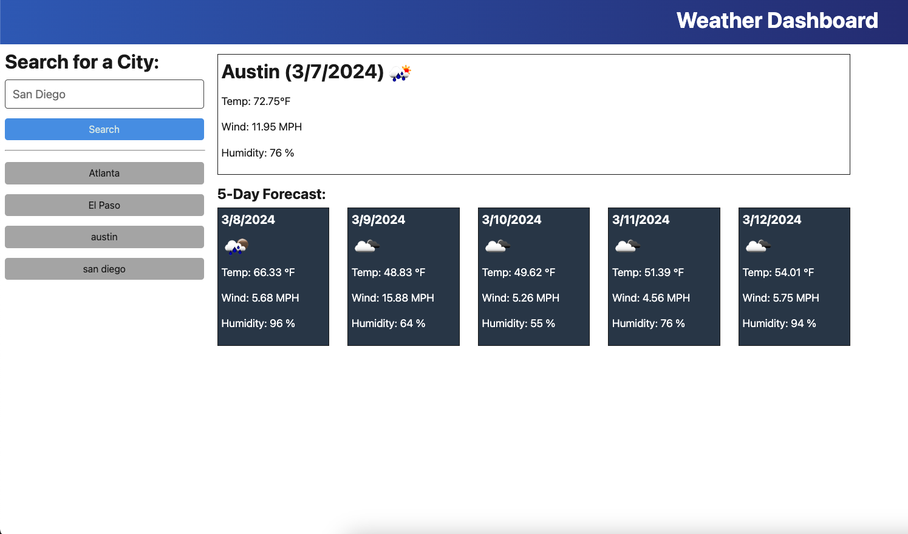

# Weather Dashboard

Welcome to the Weather Dashboard application developed by Austin Allen. This application allows users to search for weather conditions in various cities and view both current and future weather forecasts.

## Features

- **Search for Cities**: Users can enter the name of a city to search for its current weather conditions and 5-day forecast.
- **View Current Weather**: The application displays the current weather conditions for the searched city, including temperature, humidity, wind speed, and an icon representation of weather conditions.
- **View 5-Day Forecast**: Users can view a 5-day forecast for the searched city, which includes the date, temperature, humidity, and wind speed for each day.
- **Search History**: The application keeps track of the user's search history, allowing them to easily revisit previously searched cities.

## Usage

To use the Weather Dashboard application, follow these steps:

1. Open the application in your web browser.
2. Enter the name of a city in the search input field.
3. Press Enter or click the search button to retrieve weather data for the entered city.
4. View the current weather conditions and 5-day forecast for the searched city.
5. To view the weather for a previously searched city, click on the city name in the search history list.

## Deployment

## Technologies Used

The Weather Dashboard application was built using the following technologies:

- HTML5
- CSS3 (Bootstrap)
- Jass
- JavaScript (including libraries such as jQuery and Day.js)
- OpenWeather API

## Credits

- Weather icons provided by [OpenWeather](https://openweathermap.org/weather-conditions)
- Fonts from [Google Fonts](https://fonts.google.com/)
- Icons from [Font Awesome](https://fontawesome.com/)

## Developer

The weather API integration and modifications to the JavaScript code were implemented by Austin Allen.

## License

This project is licensed under the terms of the MIT license.